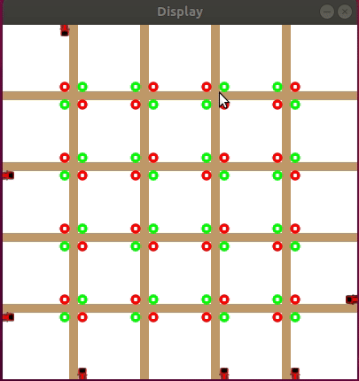

# Overview

This project gives you an OpenAI-Gym API to train your agents on.
It is episodic and gives you the current state of the traffic either as information directly or as pixels. (Pixels are currently not good implemented)

Your goal is to keep the traffic flowing.
You can decide how many cars are going in the environment at each episode. 
An episode ends after N-timesteps or after each car has left the environment.

This gif is showing one episode in the gym environment.

# Setup

Use Python3.6 or newer.
Make yourself a new virtual python environment. Preferably with anaconda.
Like:
	$ conda create -n testenv python=3.6

Activate the virtual python environment:
	$ source activate testenv

Download this repository with git.
Go into the repository, where the 'setup.py' file is and execute:
	$ pip install -e .

Now the gym_traffic environment is installed in your 'site-packages' folder in your environment

You can try the installation with two examples in the "tests/" folder.

# Reward
The reward for each timestep is calculated by the following factors
    * For each vehicle that stands multiplied by its (negative) reward factor
    * For each vehicle that moves, multiplied by its distance and its (positive) reward factor
    * For each action that was used during that timestep multiplied by its (negative) reward factor

# Action Space
The action space will consist of N variables with each time either +1 for changing the lightning, or 0 for doing nothing.
When the lightning was told to switch, the agent cannot manipulate it anymore until it has finished the switching part.

# Observation Space
The Observation Space will have following information:
  * All traffic light statuses (boolean)
  * The amount of cars directly affected by each traffic light
  
Or it will return the pixels from the environment. (Only if state_as_pixels is set to True. NOTE: This requires render to be set to True as well and will slow down training massively)

# Vehicle behaviour
Each vehicle has slightly different values for the following (given by the Variance parameter):
    * maximum speed
    * maximum speeding up
    * slowing down factor
    * distance to next car

# Parameters
The parameters are defined in the "config/parameters.cfg" file.

# API
env = gym.make("GymTraffic-v0")
env.setup(render=False, state_as_pixels=False, screen_width=400, screen_height=400, max_vehicles=1)

# GUI
You can interact with the conjuctions by clicking on them with your left mouse button and so switch the traffic light status immediately.
Moreover you can use the following keyboard buttons:
	* ESC:   Will exit the application
	* SPACE: Will pause the application until continued by pressing SPACE again

